# NoteShare - bezpieczna aplikacja do tworzenia notatek

## Zawartość

  <ol>
    <li>
      <a href="#o-aplikacji">O aplikacji</a>
      <ul>
        <li><a href="#narzędzia">Narzędzia</a></li>
      </ul>
    </li>
    <li><a href="#tworzenie-konta">Tworzenie konta</a></li>
    <li><a href="#logowanie">Logowanie</a></li>
    <li><a href="#strona-główna">Strona Główna</a></li>
    <li><a href="#notatka-publiczna">Notatka Publiczna</a></li>
    <li><a href="#udostępnienie-notatki">Udostępnienie notatki</a></li>

  </ol>

## O aplikacji

Aplikacja umożliwa tworzenie notatek, przy pomocy notacji Markdown. Notatki możemy dodatkowo udostępniać wybranym użytkownikom oraz wysyłać je do wszystkich publicznie. Ważnym elementem narzędzia jest także możliwość szyfrowania notatek przy pomocy hasła.

## Narzędzia

## **Tworzenie konta**

Aby stworzyć nowe konto musimy podać trzy podstawowe informacje: **imię**, **email** oraz **hasło**.

### Zabezpieczenia

Formularz sprawdza złożoność hasła na podstawie entropii. Jeżeli entropia hasła jest mniejsza niż 3 to hasło nie zostanie przepuszczone.

- **Wyliczanie entropii**

        const checkPassword = (password) => {
        let entropy = 0;
        let size = password.length;

        for (let i = 0; i < 256; i++) {
            let prob = (password.split(String.fromCharCode(i)).length - 1) / size;
            if (prob > 0) {
            entropy += prob * Math.log2(prob);
            }
        }

        return -entropy;
        };

- **Email musi być unikalny oraz musi być "E-Mailem"** - jeżeli system napotka jakiś błąd formularz wyświetli odpowiedni komunikat.

- **Hasło jest haszowane** - przed dodaniem hasła do bazy jest ono szyfrowane przy pomocy bcrypta z solą.

      const hashedPassword = bcrypt.hashSync(password, saltRounds);

## **Logowanie**

Aby się zaglować musimy podać email oraz hasło.

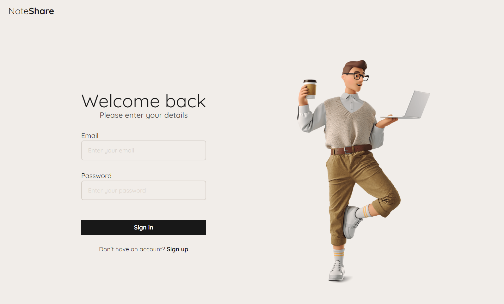

### Zabezpieczenia

- **Opóźnienie w logowaniu** - system nie dopuszcza wykonywania więcej niż jednego requesta w ciągu 2 sekund. Jeżeli będziemy próbowali brute-forcować system nas powtrzyma.

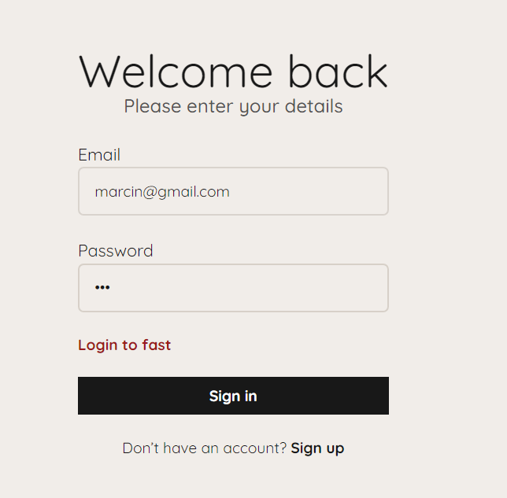

- **Blokada konta** - jeżeli źle wpiszemy hasło po raz 30. System uzna to jako próbę włamania i zablokuje zupełnie możliwość logowania. Jedyna opcja odblokowania to wiadomość do administracji.

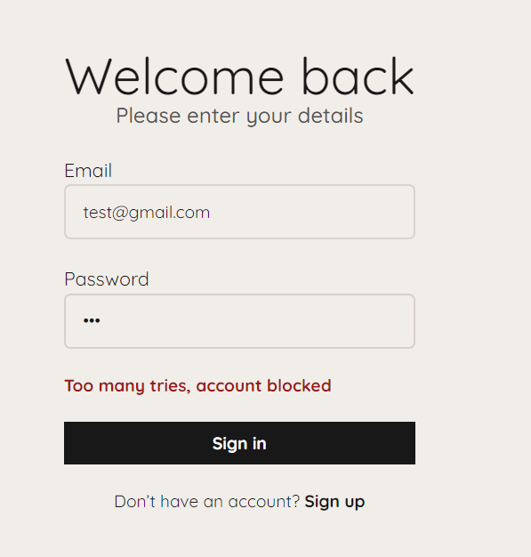

- **Śledzenie ip logujących się osób** - po prawidłowym wejściu na konto, system wysyła do bazy informację o ip zalogowane user oraz o godzinie, kiedy zalogowanie nastąpiło.

## **Strona główna**

Po zalogowaniu na swoje konto zobaczymy wszystkie nasze notatki w liście po lewej stronie. Każdą notatka ma przy sobie zębatkę służąco do wykonywania operacji na danej notatce. Symbolem plus możemy stworzyć nową notatkę. Notatki tworzymy przy pomocy Markdowna a system z niego wygeneruje nam wystylizowany output. Po utworzeniu notatki doda się ona do naszej listy.

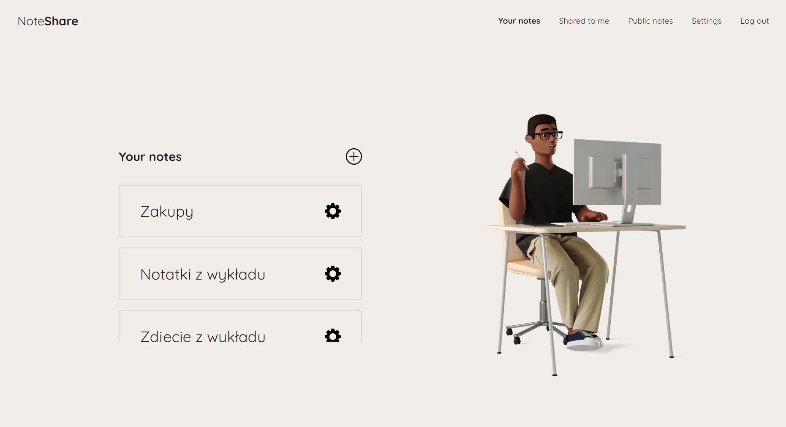

### **Przykładowa notatka z headerami**

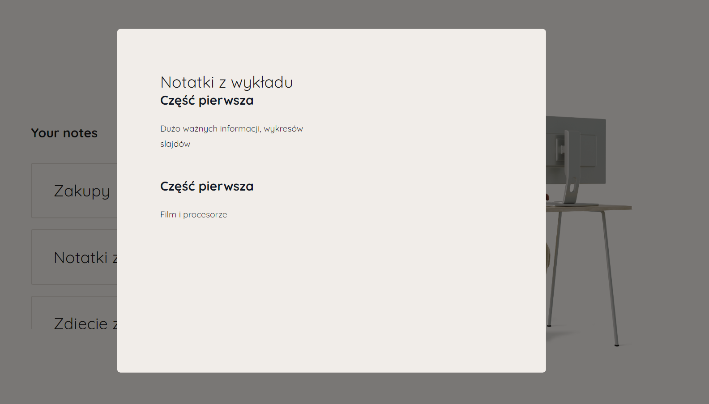

### **Przykładowa notatka ze zdjęciem**

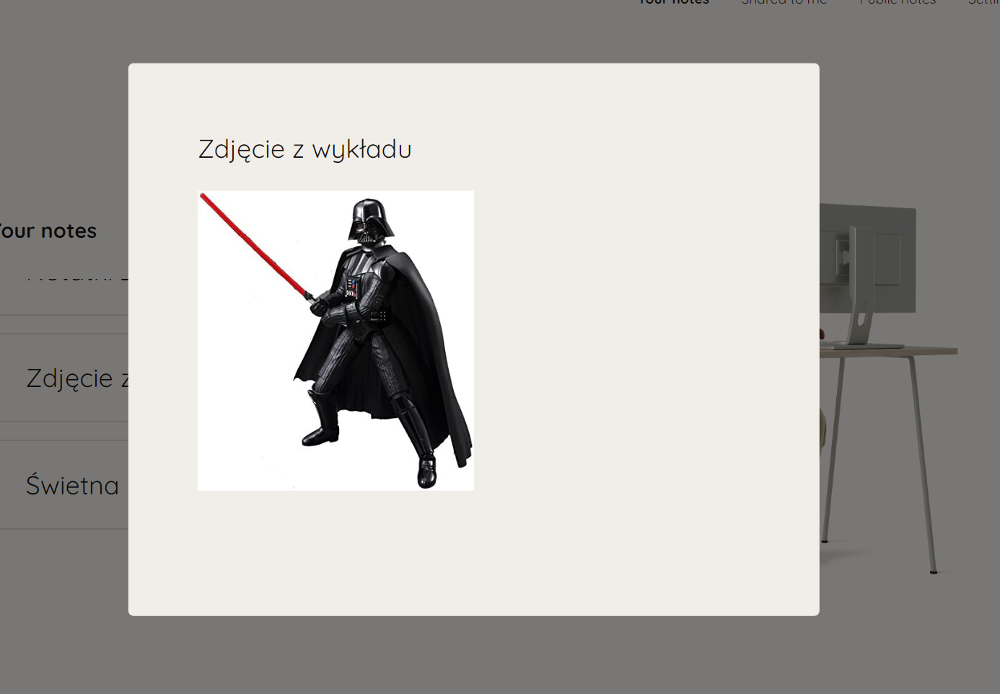

### **Opcje notatki**

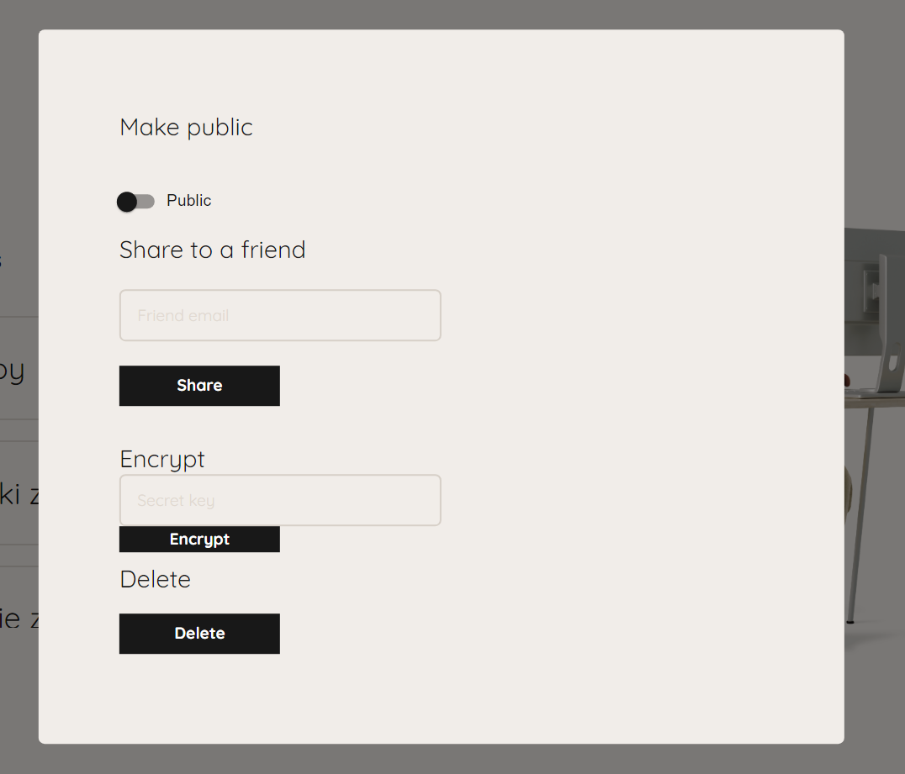

### **Tworzenie notatki**

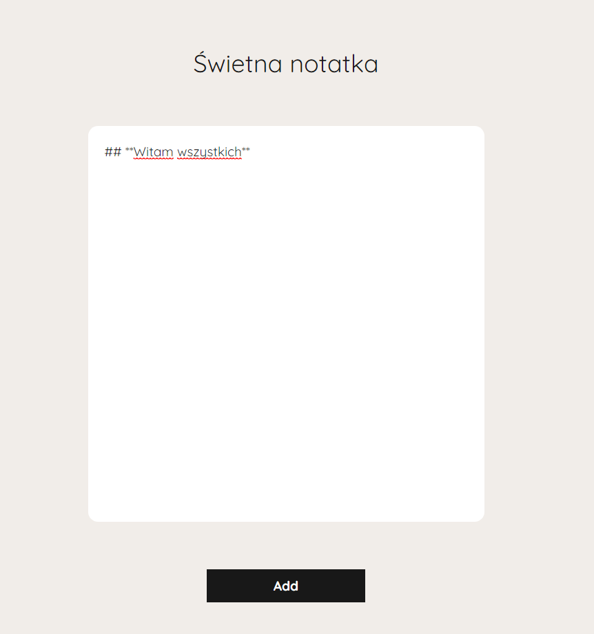

## **Notatka publiczna**

Przy pomocy przełącznika znajdującego się w panelu opcji notatki, możemy notatkę ustawić jako publiczną. Po takim działaniu trafi ona do zakładki Public, którą widzi każdy użytkownik ze swojego konta.

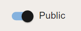

Po prawej stronie widzimy, kto jest autrem danej notatki.

## **Udostępnienie notatki**

W panelu notatki możemy również udostępnić notatkę wybranemu użytkownikowi. Wystarczy że znamy jego e-mail. Po wpisaniu emaila i zatwierdzeniu notatka pojawi się temu użytkownikowi w zakładace **Share to me**.

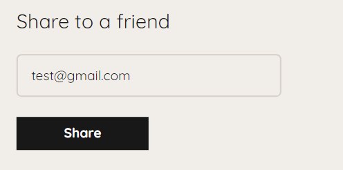

Zalogujmy się na konto **test** i zobaczmy

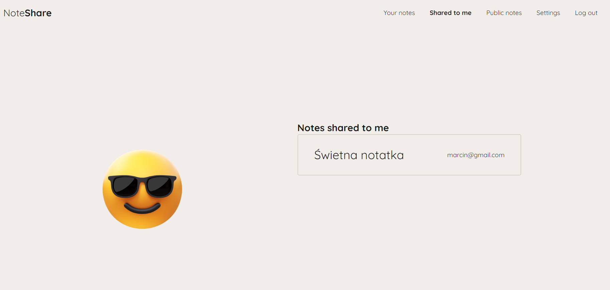
